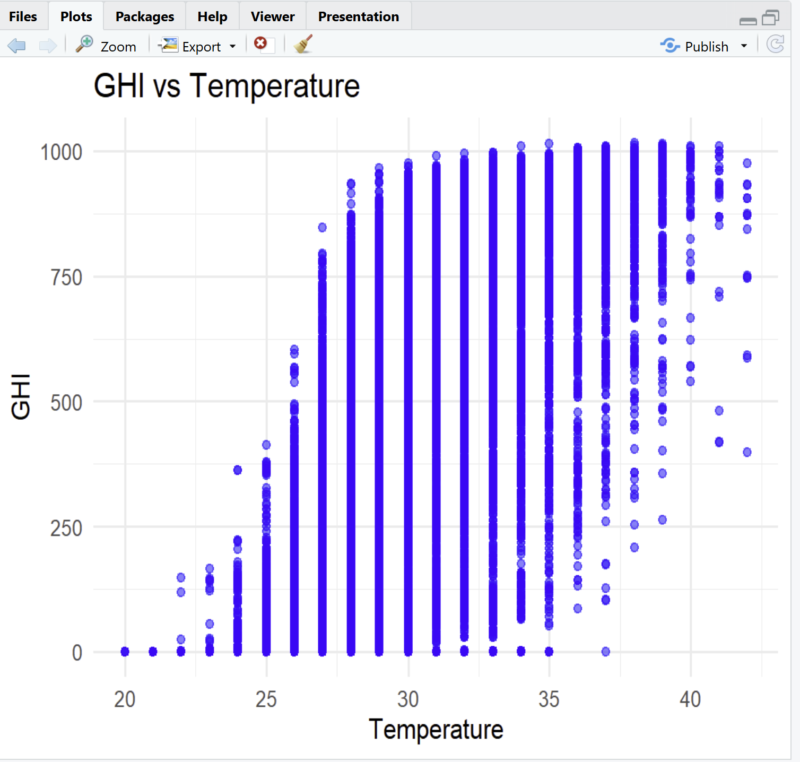
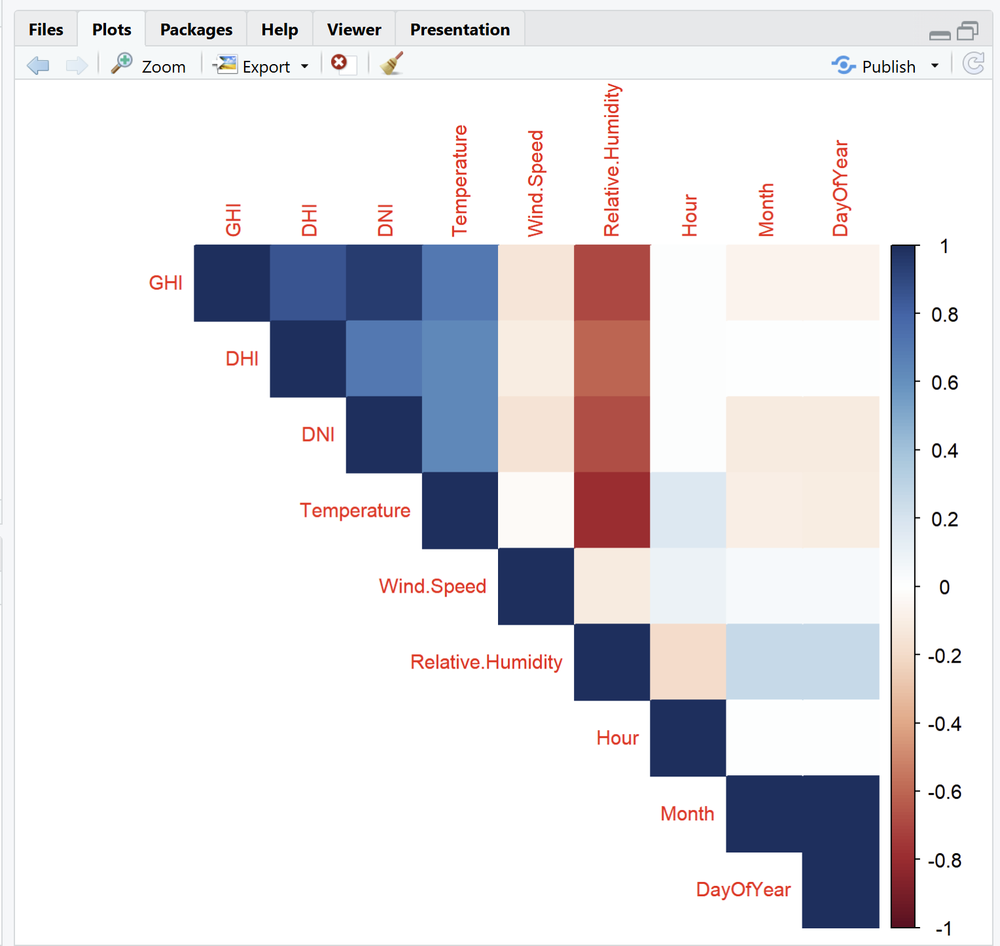
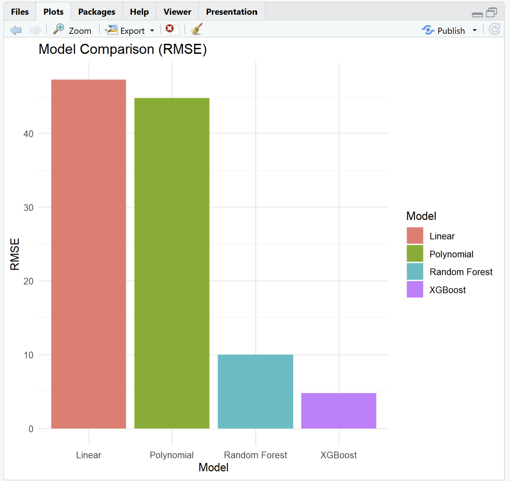
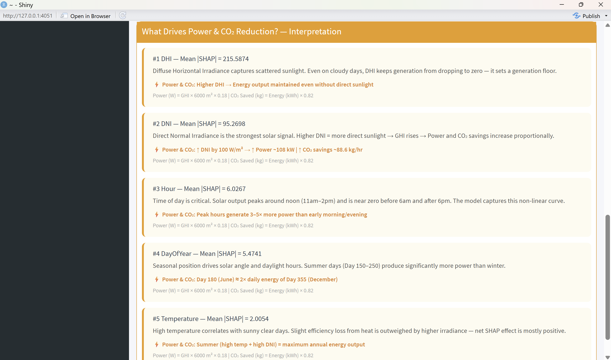
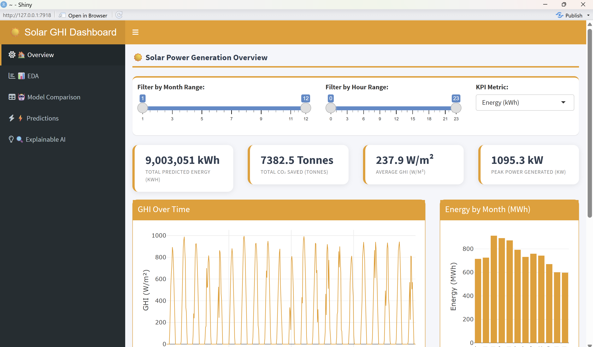
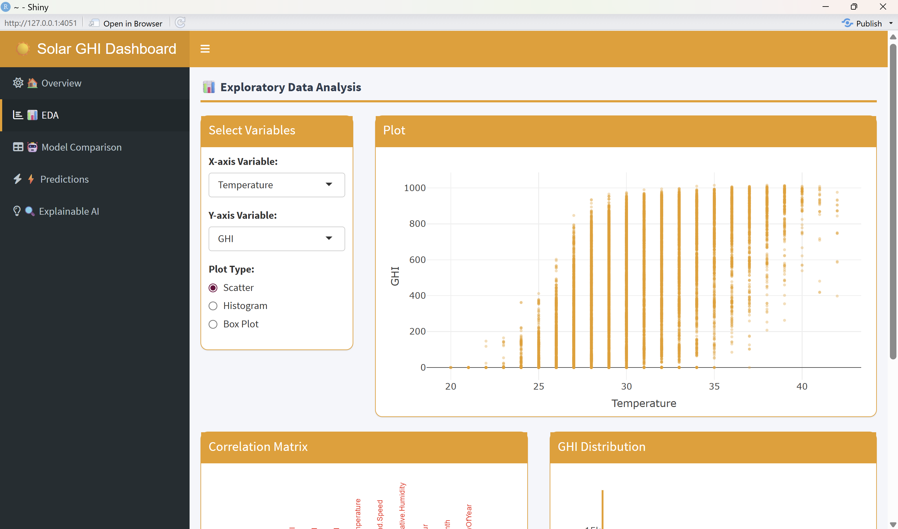
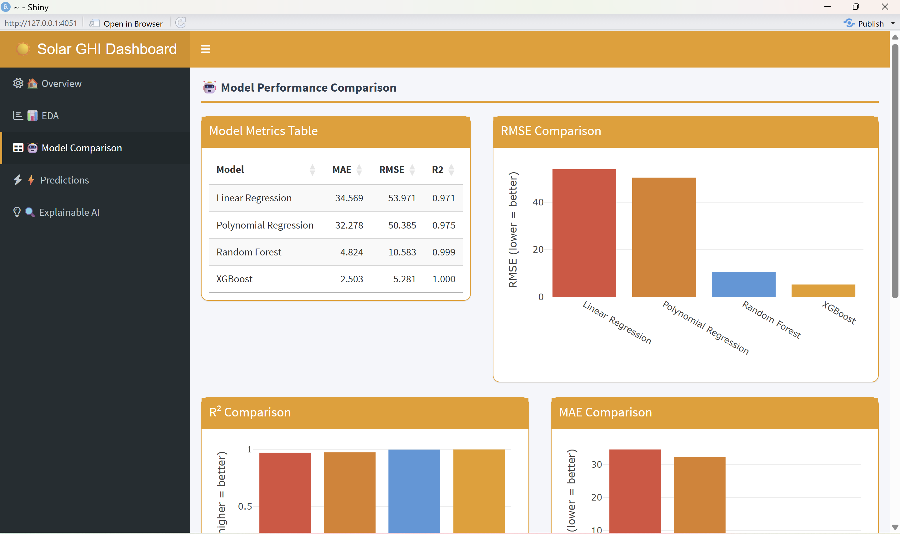
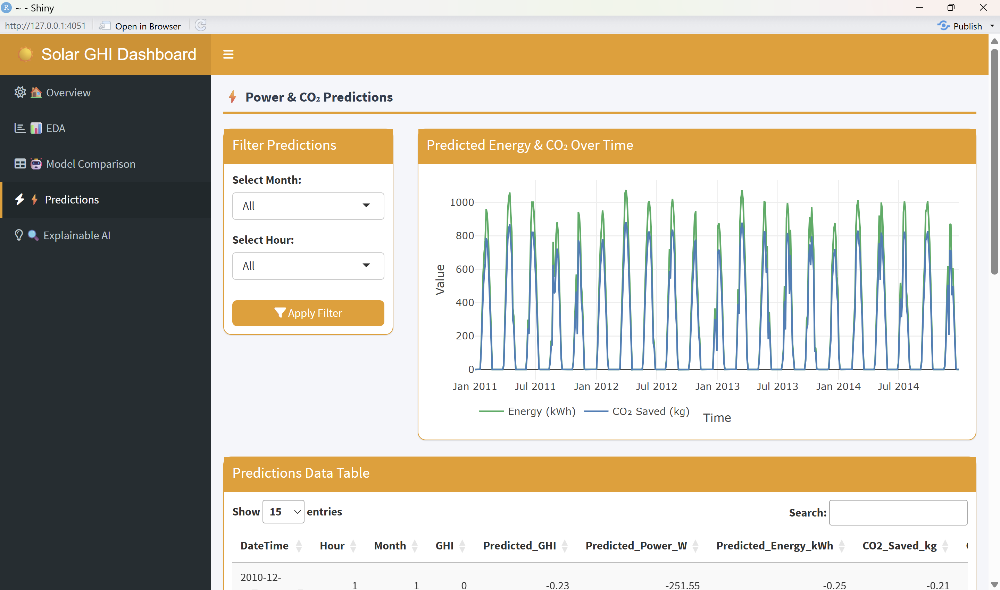
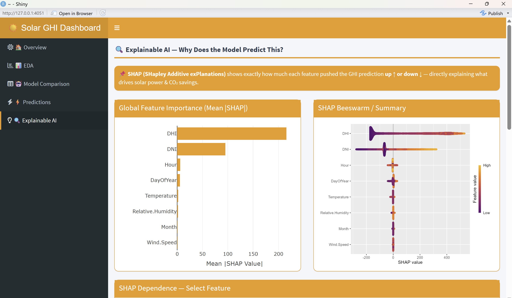

# ☀️ Solar GHI Prediction & CO₂ Emission Analysis
### An Explainable AI-Powered Solar Forecasting Dashboard built in R & Shiny


---

## 📌 Problem Statement

Accurate prediction of solar power generation is difficult because solar panel output depends on changing environmental conditions such as sunlight, temperature, and weather. Existing systems mainly focus on prediction accuracy and often lack explainability and environmental impact analysis.

This project develops an **explainable Solar Global Horizontal Irradiance (GHI) prediction system** that improves forecasting reliability while highlighting the reduction of CO₂ emissions through renewable energy usage.

---
## 🌐 Dataset Source

The dataset used in this project was obtained from the **NSRDB (National Solar Radiation Database)** provided by the **National Laboratory of the Rockies (NLR)**.

Official Website:  
https://nsrdb.nlr.gov/data-viewer

Location Selected:
- Chennai, India

The dataset contains important solar irradiance and meteorological parameters including:

- Global Horizontal Irradiance (GHI)
- Diffuse Horizontal Irradiance (DHI)
- Direct Normal Irradiance (DNI)
- Temperature
- Pressure
- Relative Humidity
- Wind Speed
- Date and Time information

The collected data was cleaned, transformed, and preprocessed before performing machine learning analysis, solar power prediction, CO₂ emission analysis, and explainable AI visualization.

## Complete Dataset Access

Due to GitHub file size limitations, the complete project datasets are hosted on Google Drive.

Datasets Included:
- Full Dataset
- Cleaned Dataset
- Prediction Output Dataset

Google Drive Link:
https://drive.google.com/drive/folders/1bKpv_Gh5xo8UUhE2NQ40s2jO0hIcpbh1?usp=sharing

## 🎯 Project Objectives

- Predict **Solar GHI** using multiple machine learning models trained on real irradiance data
- Compare all models using **MAE, RMSE, and R²** metrics
- Use the best model (XGBoost) to estimate **Solar Power (W)** and **Energy (kWh)**
- Calculate **CO₂ emission savings** and **cumulative CO₂ reduction** over time
- Build an **interactive Shiny Dashboard** with 5 modules for full project visualization
- Integrate **Explainable AI (SHAP)** to understand what drives each GHI prediction

---

## 📂 Project Structure

```
Solar-GHI-Prediction-Project/
│
├── 📄 solar_cleaned_final.csv               # Preprocessed input dataset
├── 📄 solar_full_dataset.csv                # Raw solar irradiance dataset
├── 📄 Solar_Final_Predictions_Output.csv    # Final output with all predictions
│
├── 📜 solar_project_analysis.R              # Main script: EDA → ML → Predictions → Export
├── 📜 Shiny_Explainable_AI_Code.R           # Interactive Shiny Dashboard (5 tabs)
│
├── 📁 Screenshots/                          # Dashboard & output screenshots
└── 📄 README.md
```

---

## 🔄 Project Workflow

```
Raw Data → DateTime Parsing → Feature Engineering → EDA
    → Train/Test Split (80/20) → 4 ML Models → Model Comparison
        → XGBoost Predictions on Full Dataset → Power & CO₂ Calculation
            → Export CSV → Shiny Dashboard + SHAP Explainability
```

---

## 📦 Required R Packages

### Analysis Script (`solar_project_analysis.R`)
```r
install.packages(c(
  "readr", "dplyr", "ggplot2", "corrplot",
  "caret", "randomForest", "Metrics",
  "lubridate", "gridExtra", "xgboost", "forecast"
))
```

### Shiny Dashboard (`Shiny_Explainable_AI_Code.R`)
```r
install.packages(c(
  "shiny", "shinydashboard", "shinyWidgets",
  "DT", "plotly", "ggplot2", "dplyr",
  "xgboost", "corrplot", "shapviz"
))
```

---

## 🔢 Step 1 — Data Loading & Preprocessing

- Loaded `solar_cleaned_final.csv` using `read.csv()`
- Parsed `DateTime` column using format `"%d-%m-%Y %H:%M"` via `as.POSIXct()`
- Checked for missing values using `colSums(is.na(data))`
- Engineered 3 new temporal features:

| Feature | Description |
|---|---|
| `Hour` | Hour of day (0–23) — captures daily solar cycle |
| `Month` | Month of year (1–12) — captures seasonal variation |
| `DayOfYear` | Day number (1–365) — fine-grained seasonal context |

---

## 📊 Step 2 — Exploratory Data Analysis (EDA)

### Scatter Plots

| Plot | Color | Key Insight |
|---|---|---|
| GHI vs Temperature | Blue | Positive correlation — warmer = clearer sky |
| GHI vs Wind Speed | Dark Green | Weak negative correlation |
| GHI vs Hour | Purple | Bell-curve peaking at solar noon |

### Other Visualizations
- **GHI Histogram** — Right-skewed distribution with heavy zero values at night
- **GHI Time Series** — Clear daily and seasonal periodicity
- **Correlation Matrix** — DNI and DHI are the strongest predictors of GHI

### Correlation Significance Tests
```r
cor.test(data$Temperature, data$GHI)
cor.test(data$Wind.Speed,  data$GHI)
```

### Screenshots

| EDA Scatter Plots | Correlation Matrix |
|---|---|
|  |  |

---

## ✂️ Step 3 — Train / Test Split

Data was sorted chronologically by `DateTime` and split:

- **Training set — 80%** (first 80% of records)
- **Test set — 20%** (last 20% of records — unseen future data)

```r
split_point <- floor(0.8 * nrow(data))
train <- data[1:split_point, ]
test  <- data[(split_point + 1):nrow(data), ]
```

---

## 🤖 Step 4 — Machine Learning Models

All 4 models predict **GHI** using these features:
`DHI + DNI + Temperature + Wind.Speed + Relative.Humidity + Hour + Month + DayOfYear`

---

### Model 1 — Linear Regression (Baseline)
```r
model_lm <- lm(GHI ~ DHI + DNI + Temperature + Wind.Speed +
               Relative.Humidity + Hour + Month + DayOfYear, data = train)
```

---

### Model 2 — Polynomial Regression
Adds degree-2 polynomial terms for `Temperature` and `Hour` to capture non-linear relationships:
```r
model_poly <- lm(GHI ~ DHI + DNI + poly(Temperature, 2) +
                 poly(Hour, 2) + Wind.Speed + Relative.Humidity +
                 Month + DayOfYear, data = train)
```

---

### Model 3 — Random Forest
```r
model_rf <- randomForest(
  GHI ~ DHI + DNI + Temperature + Wind.Speed +
        Relative.Humidity + Hour + Month + DayOfYear,
  data = train, ntree = 200, importance = TRUE
)
```

---

### Model 4 — XGBoost ⭐ Best Model

Features converted to a model matrix (no intercept), then trained with:

```r
params <- list(
  objective        = "reg:squarederror",
  eta              = 0.1,
  max_depth        = 6,
  subsample        = 0.8,
  colsample_bytree = 0.8,
  eval_metric      = "rmse"
)
model_xgb <- xgb.train(data = dtrain, nrounds = 200, params = params)
```

After training, XGBoost was used to predict GHI on the **full dataset** (not just test set) for the dashboard output.

---

## 📈 Step 5 — Model Comparison

| Model | MAE ↓ | RMSE ↓ | R² ↑ |
|---|---|---|---|
| Linear Regression | 34.57 | 53.97 | 0.9714 |
| Polynomial Regression | 32.28 | 50.39 | 0.9749 |
| Random Forest | 4.82 | 10.58 | 0.9990 |
| **XGBoost** ⭐ | **2.50** | **5.28** | **0.9997** |

> XGBoost outperforms all other models on every metric and was selected for final predictions.

### Screenshot


---

## ⚡ Step 6 — Solar Power & CO₂ Calculations

XGBoost predictions on the full dataset were converted into real-world energy and emission metrics:

### Formulas Used

```
Predicted_Power_W       = Predicted_GHI  ×  6000 m²  ×  0.18
Predicted_Energy_kWh    = Predicted_Power_W / 1000
CO2_Saved_kg            = Predicted_Energy_kWh × 0.82
Cumulative_CO2_Saved_kg = cumsum(CO2_Saved_kg)
```

### Assumptions

| Parameter | Value | Justification |
|---|---|---|
| Panel Efficiency | 18% | Typical commercial solar panel |
| Panel Area | 6,000 m² | ~1 MW scale solar installation |
| CO₂ Emission Factor | 0.82 kg/kWh | India average grid emission factor |

### Output File — `Solar_Final_Predictions_Output.csv`

| Column | Description |
|---|---|
| `Predicted_GHI` | XGBoost prediction (W/m²) |
| `Predicted_Power_W` | Instantaneous power output (W) |
| `Predicted_Energy_kWh` | Energy per time step (kWh) |
| `CO2_Saved_kg` | CO₂ avoided per time step (kg) |
| `Cumulative_CO2_Saved_kg` | Running total CO₂ savings (kg) |

---

## 🔍 Step 7 — Explainable AI (SHAP)

SHAP (SHapley Additive exPlanations) values were computed for the XGBoost model using the `shapviz` package to explain **why the model makes each GHI prediction**.

### SHAP Outputs

| Output | Description |
|---|---|
| Global Feature Importance | Mean \|SHAP\| bar chart — overall feature ranking |
| Beeswarm Plot | Distribution of SHAP values per feature across all samples |
| Dependence Plot | How a selected feature's value affects its SHAP contribution |
| Interpretation Cards | Plain-English explanation of top 5 feature impacts on Power & CO₂ |

### Top Features by SHAP Importance

| Rank | Feature | Why It Matters |
|---|---|---|
| 1 | DNI | Strongest direct solar signal — drives GHI up most |
| 2 | DHI | Diffuse radiation floor — maintains output on cloudy days |
| 3 | Hour | Daily solar position — bell-curve from sunrise to sunset |
| 4 | Temperature | Correlates with clear-sky conditions |
| 5 | DayOfYear / Month | Seasonal irradiance variation — summer peaks, winter lows |

### Enabling SHAP in the Dashboard

```r
# Run after training in solar_project_analysis.R:
saveRDS(model_xgb,    "xgb_model.rds")
saveRDS(train_matrix, "train_matrix.rds")

# Install shapviz:
install.packages("shapviz")

# Place both .rds files next to Shiny_Explainable_AI_Code.R, then restart the app
```

### Screenshot


---

## 🖥️ Step 8 — Interactive Shiny Dashboard

The dashboard loads `Solar_Final_Predictions_Output.csv` and presents the full project in 5 tabs with a yellow-themed Shiny UI.

---

### Tab 1 — 🏠 Overview

**KPI Cards (top row):**
- Total Predicted Energy (kWh)
- Total CO₂ Saved (Tonnes)
- Average GHI (W/m²)
- Peak Power Generated (kW)

**Charts:**
- GHI Over Time — interactive line chart
- Energy by Month (MWh) — bar chart
- Cumulative CO₂ Saved — area chart
- Power Heatmap — Hour × Month grid showing average power output



---

### Tab 2 — 📊 EDA

- User-selectable X and Y axis variables
- Three plot types: **Scatter / Histogram / Box Plot**
- Correlation Matrix (corrplot — upper triangle)
- GHI Distribution Histogram



---

### Tab 3 — 🤖 Model Comparison

- Metrics table showing MAE, RMSE, R² for all 4 models
- Side-by-side bar charts: RMSE, R², MAE
- Actual vs Predicted GHI scatter plot (XGBoost) with red dashed perfect-fit line



---

### Tab 4 — ⚡ Predictions

- Filter predictions by **Month** and **Hour**
- Dual-line chart: `Predicted_Energy_kWh` (green) vs `CO2_Saved_kg` (blue) over time
- Full filterable data table showing all output columns



---

### Tab 5 — 🔍 Explainable AI

- Global SHAP Feature Importance bar chart
- SHAP Beeswarm summary plot (via `sv_importance()`)
- SHAP Dependence plot with user-selectable feature (via `sv_dependence()`)
- Auto-generated interpretation cards explaining each top feature's effect on Power & CO₂



---

## 🚀 How to Run

### 1. Clone the Repository
```bash
git clone https://github.com/Bhaavana-git/Solar-GHI-Prediction-Project.git
cd Solar-GHI-Prediction-Project
```

### 2. Run the Analysis Script
```r
# In RStudio — this trains all models and exports the predictions CSV
source("solar_project_analysis.R")
```

### 3. (Optional) Save Models for SHAP
```r
saveRDS(model_xgb,    "xgb_model.rds")
saveRDS(train_matrix, "train_matrix.rds")
```

### 4. Launch the Shiny Dashboard
```r
shiny::runApp("Shiny_Explainable_AI_Code.R")
```

> ⚠️ `Solar_Final_Predictions_Output.csv` must be in the **same folder** as the Shiny script before launching.

---

## 🔮 Future Enhancements

- [ ] Real-time weather API integration (OpenWeatherMap / NASA POWER)
- [ ] Deep Learning models (LSTM for time-series GHI forecasting)
- [ ] Live forecasting with automated daily model retraining
- [ ] Cloud deployment on Shinyapps.io or AWS
- [ ] IoT-based real-time solar panel monitoring integration
- [ ] Multi-location and multi-panel GHI forecasting support

---

## 👩‍💻 Author

**Bhaavana**  
**Pragnya**  
Integrated M.Tech — Business Analytics  
VIT Chennai

---

*Built with ☀️ to make solar energy smarter, cleaner, and more explainable.*
